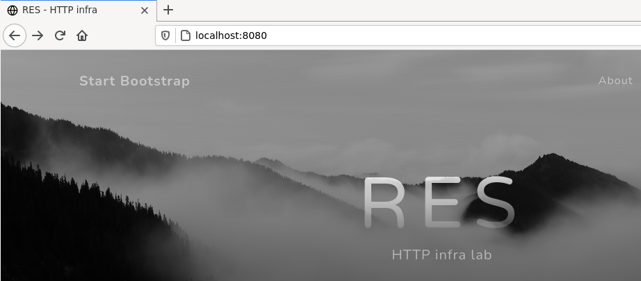
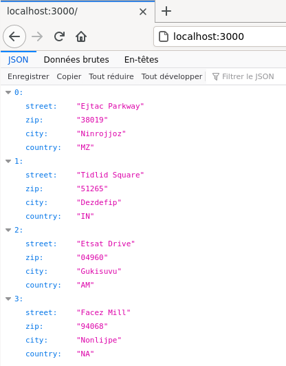
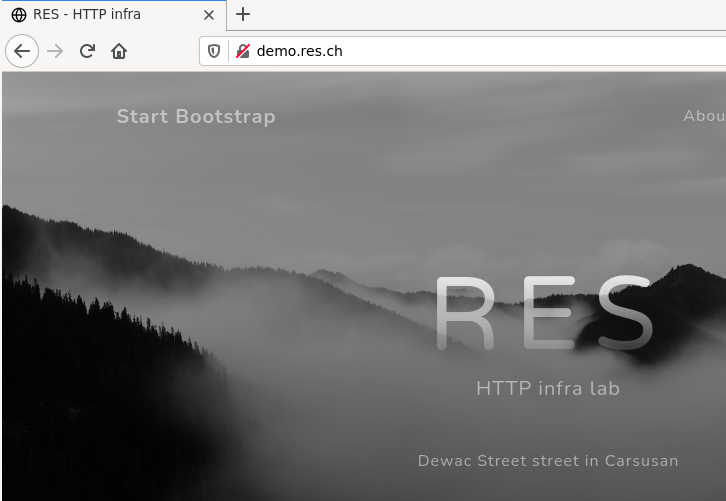
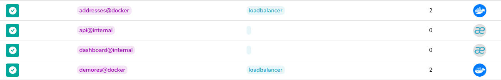

# RES - Labo HTTPInfra

Par: Godi Matthieu et Issolah Maude

Juin 2021


Laboratoire fait sur un os Linux (Fedora 33).


## Step 1 -  Serveur HTTP statique avec apache httpd

**Branche git**: `fb-apache-static`


**Objectif**

Implémenter un conteneur Docker apache servant un site web statique.


**Implémentation**

Implémentation identique à celle du cours.


- Arborescence du projet http.

````bash
docker-images/
└── apache-php-image
    ├── content # Contenu du site web
    │   ├── assets
    │   ├── css
    │   ├── index.html
    │   └── js
    └── Dockerfile

````


- Dockerfile

  Nous avons fait un `chmod 755` sur le dossier du projet (sur l'hôte), car après le téléchargement certains fichiers n'avaient pas les bon droits, pour l’exécution des scripts notamment.

````
FROM php:7.2-apache

COPY content/ /var/www/html/
````


- Commandes utiles

````bash
# Depuis le dossier contenant le Dockerfile
# Création de l'image
docker build -t res/http_infra .

# Création et lancement du container
docker run -d -p 8080:80 res/http_infra
````


- Accès au container depuis le navigateur



https://startbootstrap.com/theme/grayscale


## Step 2 - Serveur dynamique HTTP avec express.js

**Branche git**: `fb-express-dynamic`


**Objectif**

Implémentation du conteneur Docker servant une application express.js


**Implémentation**

Implémentation identique à celle du cours.


- Arborescence du projet express.js

````
express-image/
├── Dockerfile
└── src
    ├── index.js
    ├── node_modules
    │   └── chance
    ├── package.json
    └── package-lock.json

````


Nous avons choisis de retourner des adresses.

````javascript
# Extrait du fichier index.js
var addresses = [];
for (var i=0; i < numberOfAdresses; i++) {
   addresses.push({
      street: chance.street(),
      zip: chance.zip(),
      city: chance.city(),
      country: chance.country()
   });
};
console.log(addresses);
return addresses;
````


- Dockerfile

````
FROM node:14.17

COPY src /opt/app

CMD ["node", "/opt/app/index.js"]
````


- Commandes utiles

````bash
# Depuis le dossier contenant le Dockerfile
# Création de l'image
docker build -t res/express .

# Création et lancement du container
docker run -d -p 3000:3000 res/express
````


- Accès au container depuis le navigateur




## Step 3 - Reverse proxy avec apache (conf. statique)

**Branche git**: `fb-apache-reverse-proxy`


**Objectif**

Implémentaion d'un conteneur Docker servant de reverse proxy avec une configuration IP statique.


**Implémentation**

Implémentation identique à celle du cours, plus une utilisation d'un fichier docker-compose pour la suite du labo.


- Arborescence des fichiers de configuration du reverse proxy.

````
apache-reverse-proxy/
├── conf
│   └── sites-available
│       ├── 000-default.conf
│       └── 001-reverse-proxy.conf
└── Dockerfile
````


- Dockerfile

````
FROM php:7.2-apache

RUN apt update && apt install -y vim

COPY templates/ /var/apache2/

# copy content to
COPY conf/ /etc/apache2/

RUN a2enmod proxy proxy_http
RUN a2ensite 000-* 001-*
````


- Configuration du reverse proxy

````
<VirtualHost *:80>
	ServerName demo.res.ch
        ProxyPass "/api/students/" "http://173.17.0.3:3000/"
        ProxyPassReverse "/api/students/" "http://173.17.0.3:3000/"

        ProxyPass "/" "http://173.17.0.2:80/"
        ProxyPassReverse "/" "http://173.17.0.2:80/"
</VirtualHost>
````


- Docker-compose

Pour nous faciliter la vie lors de la création des containers, nous avons créé un `docker-compose` avec une assignation d'IP fixe pour chaque container. 

Cela nous permet de les créer tous en même temps avec la garantie que le fichier de configuration du proxy sera juste (IPs).

````
  version: '3.9'
  
  services:
  
    rproxy:
      privileged: true
      container_name : rproxy
      build: apache-reverse-proxy/
      networks:
        lan:
          ipv4_address: 173.17.0.4
  
    web:
      privileged: true
      container_name : web
      build: docker-images/apache-php-image/
      networks:
        lan:
          ipv4_address: 173.17.0.2
  
    express:
      privileged: true
      container_name : express
      build: express-image/
      networks:
        lan:
          ipv4_address: 173.17.0.3
  
  networks:
    lan:
      driver: bridge
      ipam:
        config:    
          - subnet: 173.17.0.0/24
````


  - Création et lancement des trois containers

    `docker-compose up --detach` depuis le dossier contenant le fichier `docker-compose.yml`


- Configuration de l'hôte

Ajouter la ligne ci-dessous au fichier `/etc/hosts` Pour pouvoir accéder au reverse proxy avec le nom de domaine `demo.res.ch`.

````
173.17.0.4  demo.res.ch
````

  ​    

- Résultat


## Step 4 - Requêtes AJAX avec JQuery

**Branche git**: `fb-express-dynamic`


**Objectif**

Implémenter un script sur le serveur web statique qui fera une requête Ajax au serveur qui fourni l'application express.js. Le tout via le reverse proxy.


**Implémentation**

Implémentation identique a cele du cours avec quelques adaptations.


- Fichier addresses.js

Ce script sera lancé depuis le site web, et fait une requête au reverse proxy sur `/api/students` pour demander les adresses créées sur le container express-js.

````javascript
$(function() {
   console.log("Loading addresses");

   function loadAddresses() {
      $.getJSON("/api/students/", function(addresses) {
         console.log(addresses);
         var message = "No addresses";
         if (addresses.length > 0 ) {
            message = addresses[0].street + " street in " + addresses[0].city;
         }
         $(".skills").text(message);
      });
   };
loadAddresses();
setInterval(loadAddresses, 2000);
});
````


- Modification du template Bootstrap

Pour pouvoir recopier le code exemple du cours, nous avons ajouté une classe `skills` au paragraphe qui affiche les adresses.

Nous avons aussi du ajouter un lien vers les librairies JQuery pour que notre script puisse fonctionner.

Notre choix s'est porté sur un téléchargement des librairies pour limiter le poids de notre containers.

````html
<div class="text-center">
   <h1 class="mx-auto my-0 text-uppercase">RES</h1>
   <h2 class="text-white-50 mx-auto mt-2 mb-5">HTTP infra lab</h2>
    <!-- Ajout classe skills -->
   <p class="skills text-white-50 mx-auto mt-2 mb-5">Addresses</p>
   <a class="btn btn-primary" href="#about">Get Started</a>
</div>

(...)

<!-- Custom script to load addresses-->
<script src="https://ajax.googleapis.com/ajax/libs/jquery/3.5.1/jquery.min.js"></script>
<script src="js/addresses.js"></script>
````


- Création et lancement des trois containers

`docker-compose up --detach` depuis le dossier contenant le fichier `docker-compose.yml`

*Le fichier `docker-compose` est le même qu'à l'étape précédente.*


- Résultat

Grâce au script nous avons un affichage dynamique du contenu obtenu d'un autre container (sous la ligne `HTTP infra lab`).




## Step 5 - Reverse proxy dynamique

**Branche git**: `fb-express-dynamic`


**Objectif**

Implémenter une méthode pour ne pas avoir une configuration statique des IP du reverse proxy. 


**Implémentation**

La première implémentation est identique a celle du cours, et nous avons aussi testé le dns de Docker.


- Modification du fichier docker-compose.yml

Nous avons ajouté les variables d'environnement au fichier, elles seront traitées automatiquement.

````
(...)
reverse-proxy:
  privileged: true
  container_name : res_proxy
  hostname : res.proxy
  build: apache-reverse-proxy/
  networks:
    lan:
      ipv4_address: 173.17.0.4   
    environment: 
      - STATIC_APP=173.17.0.2:80
      - DYNAMIC_APP=173.17.0.3:3000 
 (...)
````


- Fichier `template/config-template.php`

Ce fichier est un template pour la création de virtualhost, avec un remplacement des ip statique mise précédemment par des variables `php`.


- Fichier  `apache2-foreground`

Ce script est exécuté par apache après la création du container.

Il copie notre template dans `sites-available/001-reverse-proxy.conf` en remplaçant les variables `php` par leur valeur.


- Modification du fichier `Dockerfile` 

````
FROM php:7.2-apache

RUN apt update && apt install -y vim

COPY apache2-foreground /usr/local/bin
COPY templates/ /var/apache2/

# copy content to
COPY conf/ /etc/apache2/

RUN a2enmod proxy proxy_http
RUN a2ensite 000-* 001-*
````


**Option DNS**

Une autre option que nous avions utilisé était l'utilisation du dns de Docker pour la résolution des nom.

Cette solution ne nécessite rien d'autre que le remplacement des adresses IP par les noms d'hôtes des containers cibles.

````
<VirtualHost *:80>
	ServerName demo.res.ch

        ProxyPass "/api/students/" "http://res.express:3000/"
        ProxyPassReverse "/api/students/" "http://res.express:3000/"

        ProxyPass "/" "http://res.http:80/"
        ProxyPassReverse "/" "http://res.http:80/"
</VirtualHost>
````


- Création et lancement des trois containers

`docker-compose up --detach` depuis le dossier contenant le fichier `docker-compose.yml`


## Bonus - Load balancing et sticky session

**Branche git**: `fb-loadbalance`


**Objectif**

Implémenter des clusters fournissant le même service, ainsi qu'un suivi de connexion entre le client et le serveur.


**Implémentation**

L'implémentation a été faite en suivant la documentation d'Apache, ainsi que la lecture de tutoriels.


- Arborescence du dossier

````
apache-reverse-proxy/
├── conf
│   ├── conf-enabled
│   │   ├── loadbalancer_dynamic.conf
│   │   ├── loadbalancer-manager.conf
│   │   └── loadbalancer_static.conf
│   └── sites-available
│       ├── 000-default.conf
│       └── 001-reverse-proxy.conf
└── Dockerfile
````


Nous avons choisis de repartir sur l'idée d'utiliser le dns de Docker plutôt qu'un script `php` pour la configuration des lien vers les containers.

La `sticky session` est gérée avec le cookie qui enregistre la route utilisée.


- Fichier `loadbalancer_static.conf` 

Ce fichier contient la configuration du cluster pour le site web.

````
Header add Set-Cookie "ROUTEID1=.%{BALANCER_WORKER_ROUTE}e; path=/" env=BALANCER_ROUTE_CHANGED
<Proxy "balancer://staticCluster">
    BalancerMember "http://res.http1:80" route=1
    BalancerMember "http://res.http2:80" route=2
    ProxySet stickysession=ROUTEID1
</Proxy>
ProxyPass        "/" "balancer://staticCluster/"
ProxyPassReverse "/" "balancer://staticCluster/"

ProxyPass "/lb-manager" "!"
````


- Fichier `loadbalancer_dynamique.conf`

Ce fichier contient la configuration du cluster pour l'application express js.

````
Header add Set-Cookie "ROUTEID2=.%{BALANCER_WORKER_ROUTE}e; path=/" env=BALANCER_ROUTE_CHANGED
<Proxy "balancer://dynamicCluster">
    BalancerMember "http://res.express1:3000" route=3
    BalancerMember "http://res.express2:3000" route=4
    ProxySet stickysession=ROUTEID2
</Proxy>
ProxyPass        "/api/students/" "balancer://dynamicCluster/"
ProxyPassReverse "/api/students/" "balancer://dynamicCluster/"

ProxyPass "/lb-manager" "!"
````


- Modification du fichier `001-reverse-proxy.conf`

````
<VirtualHost *:80>
	ServerName demo.res.ch
</VirtualHost>
````


- Modification du fichier `Dockerfile`

Ajout des modules apache nécessaires.

````
FROM php:7.2-apache

RUN apt update && apt install -y vim

COPY apache2-foreground /usr/local/bin
COPY templates/ /var/apache2/

# copy content to
COPY conf/ /etc/apache2/

RUN a2enmod proxy proxy_http proxy_balancer lbmethod_bytraffic lbmethod_byrequests headers
RUN a2ensite 000-* 001-*
````


- Création et lancement des trois containers

`docker-compose up --detach` depuis le dossier contenant le fichier `docker-compose.yml`


### Load balancer manager

Ce manager nous permet d'avoir des statistiques sur l'utilisation des différents containers.

Il est possible de le configurer pour limiter son accès avec un login (voir le deuxième lien de la webographie de cette partie). Nous ne l'avons pas implémenté dans le cadre de ce projet pour des questions de temps.

- Fichier `loadbalancer-manager.conf`

````
<location "/lb-manager">
        SetHandler balancer-manager
        allow from all
</location>
````


Après avoir ouvert plusieurs onglets sur `demo.res.ch` nous pouvons voir dans les statistiques, que les deux containers `res.express` ont été utilisés. Ça n'est pas le cas pour les containers `res.http`, mais étant donnée que la configuration est la même, et que le site ne demande pas beaucoup de ressources, nous pouvons valider le load balancer (qui sera géré autrement plus tard)


- Webographie

  Liens principaux utilisés pour nous documenter.

  https://httpd.apache.org/docs/2.4/fr/mod/mod_proxy_balancer.html

  https://www.inmotionhosting.com/support/server/apache/apache-load-balancer/


- Validation de la sticky session

Nous pouvons observer la présence d'un cookie qui enregistre la route utilisée.


## Bonus - Management UI

**Objectif**

Créer/utiliser une application graphique de gestion de containers.


**Implémentation**

Comme proposé, nous avons choisis d'utiliser une application existante.

Portainer.io permet de gérer facilement et efficacement son environnement Docker.

https://www.portainer.io/


- Déploiement de Portainer

https://documentation.portainer.io/v2.0/deploy/ceinstalldocker/

````
docker volume create portainer_data

docker run -d -p 8000:8000 -p 9000:9000 --name=portainer --restart=always --pull=always -v /var/run/docker.sock:/var/run/docker.sock -v portainer_data:/data portainer/portainer-ce
````


- Mise à jour de Portainer

Il faut supprimer le container, puis relancr la commande `docker run` ci-dessus.


## Bonus - Dynamic cluster management

**Branche git**: `fb-traefik`


**Objectif**

Développer une infrastructure dynamique qui s'adapte automatiquement à l'ajout/suppression de containers.


**Implémentation**

Pour cette étape nous avons choisi d'utiliser Traefik qui remplacera toutes les configurations précédentes (reverse proxy, loadbalancer...).

Nous n'utiliserons plus le container apache-reverse-proxy.


### Configuration de Traefik

La configuration de base se fait dans un fichier YML.

- Fichier traefik.yml

````bash
log:
  level: INFO

# Activer le dashboard
api:
  insecure: true
  dashboard: true

# points d'entrées de l'infrastructure
entryPoints:
  http:
    address: ":80"

# Systèmes avec lesquels Traefik doit travailler
providers:
  docker:
    # Enables the web UI and tells Traefik to listen to docker
    endpoint: "unix:///var/run/docker.sock"
    watch: true
    # only expose docker with traefik.enable=true
    exposedByDefault: false 
````

Ce fichier est lié au container Traefik dans le fichier `docker-compose.yml`.

Toute les autres configuration pour ce projet sont faites dans ce même fichier.

 

### Configuration dynamique

Par défaut Traefik offre une configuration dynamique sur les containers qui sont suivis.

Il suffit d'ajouter ce label aux containers:

````
labels:
  - "traefik.enable=true"
````


### Reverse proxy

Traefik est un revers proxy, pour le configurer il faut ajouter les labels suivants aux containers:

- Express.js containers

````
labels:
  - "traefik.http.routers.express1.entrypoints=http"
  - "traefik.http.routers.express1.rule=Host(`demo.res.com`) && Path(`/api/students/`)"
  - "traefik.http.routers.express1.service=addresses"
````

- Static web container

````
labels:
  - "traefik.http.routers.http2.entrypoints=http"
  - "traefik.http.routers.http2.rule=Host(`demo.res.com`)"
  - "traefik.http.routers.http2.service=demores"
````

Nous définissons les routes qui seront liés a chaque container, ainsi qu'un nom pour le service offert.

Traefik fera automatiquement le lien entre ce qui arrive sur l'infrastructure sur le port 80 (http), avec l'url définie, vers le bon container.

Il n'y a plus besoin de modifier le fichier `/etc/hosts` de la machine hôte, ni d'utiliser des IPs. C'est pourquoi dans cette configuration nous utilisons `demo.res.com` qui n'est pas listé dans ce fichier.


#### Configuration des requêtes entre le site web et l'application express.js

Précédemment, nous avons défini la route qui est liée à l'application express.js, et qui est utile pour faire le lien entre le site web et l'application (`demo.res.com/api/students/`).

Le problème est que Traefik renvoie la requête tel quel au container final, qui reçoit donc la requête: `GET /api/student/` .

En utilisant un middleware Traefik, on peut modifier la requête avant qu'elle n'arrive au destinataire final.

Une fois de plus, ceci est fait avec des labels:

````
labels:
  # Creation d'un middleware nommé replace-path
  - "traefik.http.middlewares.replace-path.replacepath.path=/"
  # Application du middleware 
  - "traefik.http.routers.express2.middlewares=replace-path"
````

Nous remplaçons `/api/students/` par `/`.


- Traefik routers


### Load balancer

La création de clusters se fait en définissant le même service sur plusieurs containers, et en ajoutant un label pour préciser que nous voulons que ce container soit load balanced.


- Static web container

````
labels:
  - "traefik.http.services.demores.loadbalancer.server.port=80"
````

- Express.js containers

````
labels:
  - "traefik.http.services.addresses.loadbalancer.server.port=3000"
````


- Traefik services




### Sticky session

Cette option est activée en ajoutant un label pour chaque services.

````
labels:
  - "traefik.http.services.addresses.loadbalancer.sticky.cookie.name=route-express"
````

````
labels:
  - "traefik.http.services.demores.loadbalancer.sticky.cookie.name=route-http"
````


### Round robin

Cette option est celle par défaut, et la seule,  pour le load balancing.

Il n'y a donc rien à faire.


### Création des clusters

Le fichier `docker-compose.yml` défini trois containers:

- traefik
- http : site web statique
- express : application express.js

La commande ci-dessous permet de définir le nombre de containers créés.

````
docker-compose up --detach --scale http=3 --scale express=2
````


### Validation 

(Sauf sticky session, car l'ajout de la sticky session rend la validation des autres point plus difficile vu que le navigateur reste sur son cookie.)


| IPs sites web | IPs applications | IP Traefik |
| ------------- | ---------------- | ---------- |
| 172.22.0.2    | 172.22.0.4       | 172.22.0.3 |
| 172.22.0.5    | 172.22.0.6       |            |

Nous pouvons observer la modification de la requête entre la réception par Traefik (`GET /api/students/`) et sont renvoi (`GET /`), ainsi que  le fait que les deux IPs de l'application sont utilisées alternativement (Round Robin).

